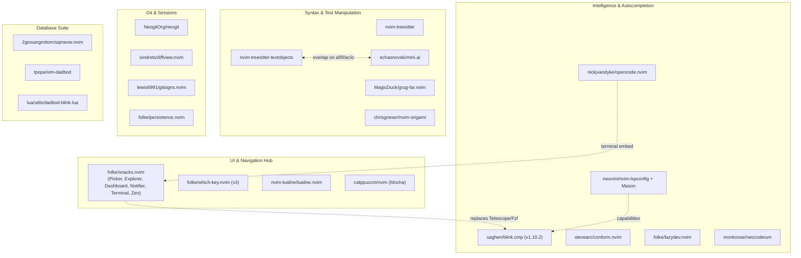

# Neovim Configuration Maintenance & Plugin Audit Guide (`agent.md`)

This document serves as the single source of truth for auditing, updating, and maintaining all Neovim plugins in [`/home/georgek/.config/nvim`](file:///home/georgek/.config/nvim). Modeled after [`database_agent.md`](file:///home/georgek/.config/nvim/database_agent.md), future AI pairing sessions and maintainers should use this playbook to audit upstream plugin changes, detect redundant user code, track breaking changes, and evaluate modern plugin alternatives.

---

## 1. Upstream Baseline Reference & Inventory

The table below catalogs all **38 installed plugins** managed by `lazy.nvim` as of **September 29, 2026**.
- **Historical Audit Scope**: Covers updates from **July 1, 2026** to **September 29, 2026**.
- **Future Audit Rule**: Any future session running an audit must **only** inspect commits introduced **after** the pinned baseline commit hash recorded in this table.

```bash
# Standard protocol for future sessions to inspect updates on any plugin:
git -C ~/.local/share/nvim/lazy/<plugin_dir> fetch origin
git -C ~/.local/share/nvim/lazy/<plugin_dir> log <BASELINE_COMMIT>..origin/HEAD --oneline
```

### Master Plugin Inventory

| Plugin Name | Repository Slug | Baseline Commit | Commit Date | Active Config File | Audit Status (Sep 2026) |
|---|---|---|---|---|---|
| **snacks.nvim** | `folke/snacks.nvim` | `882c996` | 2026-05-25 | [`lua/plugins/snacks-*.lua`](file:///home/georgek/.config/nvim/lua/plugins/snacks-picker.lua) | ✓ Up to date on `main` |
| **blink.cmp** | `saghen/blink.cmp` | `78336bc` (`v1.10.2`) | 2026-04-04 | [`lua/plugins/autocompletion.lua`](file:///home/georgek/.config/nvim/lua/plugins/autocompletion.lua) | ⚠️ Pinned to `v1.*`; 240 commits on `main` for v2 |
| **blink-cmp-dictionary** | `Kaiser-Yang/blink-cmp-dictionary` | `898a958` | 2026-06-01 | [`lua/plugins/autocompletion.lua`](file:///home/georgek/.config/nvim/lua/plugins/autocompletion.lua#L44) | ✓ Up to date |
| **LuaSnip** | `L3MON4D3/LuaSnip` | `642b0c5` | 2026-03-21 | [`lua/plugins/autocompletion.lua`](file:///home/georgek/.config/nvim/lua/plugins/autocompletion.lua#L10) | ⚠️ 14 commits behind on `master` (pinned `v2.*`) |
| **friendly-snippets** | `rafamadriz/friendly-snippets` | `b4d01b0` | 2026-09-10 | [`lua/plugins/autocompletion.lua`](file:///home/georgek/.config/nvim/lua/plugins/autocompletion.lua#L18) | ✓ Up to date |
| **lspkind.nvim** | `onsails/lspkind.nvim` | `c7274c4` | 2026-01-29 | [`lua/plugins/autocompletion.lua`](file:///home/georgek/.config/nvim/lua/plugins/autocompletion.lua#L47) | ✓ Up to date |
| **lazydev.nvim** | `folke/lazydev.nvim` | `ff2cbcb` | 2026-03-14 | [`lua/plugins/lsp.lua`](file:///home/georgek/.config/nvim/lua/plugins/lsp.lua#L6) | ✓ Up to date |
| **nvim-lspconfig** | `neovim/nvim-lspconfig` | `a9bb4d5` | 2026-09-26 | [`lua/plugins/lsp.lua`](file:///home/georgek/.config/nvim/lua/plugins/lsp.lua#L19) | ✓ 131 commits audited since July 2026 |
| **mason.nvim** | `mason-org/mason.nvim` | `2a6940a` | 2026-06-11 | [`lua/plugins/lsp.lua`](file:///home/georgek/.config/nvim/lua/plugins/lsp.lua#L22) | ✓ Up to date |
| **mason-lspconfig.nvim** | `mason-org/mason-lspconfig.nvim` | `b329899` | 2026-09-27 | [`lua/plugins/lsp.lua`](file:///home/georgek/.config/nvim/lua/plugins/lsp.lua#L23) | ✓ Up to date |
| **mason-tool-installer.nvim** | `WhoIsSethDaniel/mason-tool-installer.nvim` | `443f1ef` | 2026-01-22 | [`lua/plugins/lsp.lua`](file:///home/georgek/.config/nvim/lua/plugins/lsp.lua#L24) | ✓ Up to date |
| **fidget.nvim** | `j-hui/fidget.nvim` | `9e02016` | 2026-09-03 | [`lua/plugins/lsp.lua`](file:///home/georgek/.config/nvim/lua/plugins/lsp.lua#L27) | ✓ Up to date |
| **conform.nvim** | `stevearc/conform.nvim` | `016802d` | 2026-08-11 | [`lua/plugins/autoformat.lua`](file:///home/georgek/.config/nvim/lua/plugins/autoformat.lua) | ✓ 11 commits audited since July 2026 |
| **nvim-treesitter** | `nvim-treesitter/nvim-treesitter` | `728e031` | 2026-09-27 | [`lua/plugins/treesitter.lua`](file:///home/georgek/.config/nvim/lua/plugins/treesitter.lua#L3) | ✓ Parsers updated; textobjects cleanly delegated to mini.ai |
| **nvim-treesitter-textobjects** | `nvim-treesitter/nvim-treesitter-textobjects` | `5c7b026` | 2026-09-03 | [`lua/plugins/treesitter.lua`](file:///home/georgek/.config/nvim/lua/plugins/treesitter.lua#L19) | ✓ Dedicated exclusively to jump motions |
| **mini.ai** | `echasnovski/mini.ai` | `6c39ae7` | 2026-09-21 | [`lua/plugins/mini-ai.lua`](file:///home/georgek/.config/nvim/lua/plugins/mini-ai.lua) | ✓ Mode-based reference region update audited |
| **neocodeium** | `monkoose/neocodeium` | `ab8a3da` (`v1.19.1`) | 2026-06-22 | [`lua/plugins/neocodeium.lua`](file:///home/georgek/.config/nvim/lua/plugins/neocodeium.lua) | ✓ Monkey-patch still active and required |
| **opencode.nvim** | `nickjvandyke/opencode.nvim` | `84eabfb` (`v1.0.2`) | 2026-09-14 | [`lua/plugins/opencode.lua`](file:///home/georgek/.config/nvim/lua/plugins/opencode.lua) | ⚠️ Pinned to `v1.0.2` matching stable CLI 1.18.33 |
| **gitsigns.nvim** | `lewis6991/gitsigns.nvim` | `070a5d7` | 2026-09-22 | [`lua/plugins/gitsigns.lua`](file:///home/georgek/.config/nvim/lua/plugins/gitsigns.lua) | ✓ 23 commits audited since July 2026 |
| **neogit** | `NeogitOrg/neogit` | `c51a1dc` | 2026-09-28 | [`lua/plugins/neogit.lua`](file:///home/georgek/.config/nvim/lua/plugins/neogit.lua) | ✓ Up to date |
| **diffview.nvim** | `sindrets/diffview.nvim` | `4516612` | 2024-06-13 | [`lua/plugins/neogit.lua`](file:///home/georgek/.config/nvim/lua/plugins/neogit.lua#L5) | Stable, no recent upstream changes |
| **grug-far.nvim** | `MagicDuck/grug-far.nvim` | `11595bf` | 2026-08-13 | [`lua/plugins/grug-far.lua`](file:///home/georgek/.config/nvim/lua/plugins/grug-far.lua) | ✓ 29 commits audited since July 2026 |
| **which-key.nvim** | `folke/which-key.nvim` | `3aab214` (`v3.*`) | 2025-10-28 | [`lua/plugins/which-key.lua`](file:///home/georgek/.config/nvim/lua/plugins/which-key.lua) | ✓ Modern v3 spec format verified |
| **lualine.nvim** | `nvim-lualine/lualine.nvim` | `221ce6b` | 2026-05-31 | [`lua/plugins/lualine.lua`](file:///home/georgek/.config/nvim/lua/plugins/lualine.lua) | ✓ Up to date |
| **catppuccin** | `catppuccin/nvim` | `edefef7` | 2026-08-09 | [`lua/plugins/colorscheme.lua`](file:///home/georgek/.config/nvim/lua/plugins/colorscheme.lua) | ✓ Auto-integrations for Snacks/Blink audited |
| **render-markdown.nvim** | `MeanderingProgrammer/render-markdown.nvim` | `640a3ec` (`v8.14.0`) | 2026-09-14 | [`lua/plugins/markdown.lua`](file:///home/georgek/.config/nvim/lua/plugins/markdown.lua#L3) | ✓ Multiline table cells & virtual line rendering |
| **mkdnflow.nvim** | `jakewvincent/mkdnflow.nvim` | `272148c` | 2026-07-03 | [`lua/plugins/markdown.lua`](file:///home/georgek/.config/nvim/lua/plugins/markdown.lua#L37) | Retained per user request |
| **nvim-origami** | `chrisgrieser/nvim-origami` | `a137d35` | 2026-08-03 | [`lua/plugins/fold-origami.lua`](file:///home/georgek/.config/nvim/lua/plugins/fold-origami.lua) | ✓ Up to date |
| **persistence.nvim** | `folke/persistence.nvim` | `b20b2a7` | 2025-10-28 | [`lua/plugins/session-manager.lua`](file:///home/georgek/.config/nvim/lua/plugins/session-manager.lua) | Stable session persistence |
| **todo-picker** | `george-tk/todo-picker` | `9e48dc0` | 2026-07-22 | [`lua/plugins/todo.lua`](file:///home/georgek/.config/nvim/lua/plugins/todo.lua) | User custom plugin; added `ToDoLog` & `ToDoBoard` |
| **sqmeow.nvim** | `2giosangmitom/sqmeow.nvim` | `74ae98e` | 2026-09-29 | [`lua/plugins/database.lua`](file:///home/georgek/.config/nvim/lua/plugins/database.lua) | ✓ Up to date (PR #57 merged upstream: native cluster database support in `:Sqmeow use` and `api.databases`) |
| **vim-dadbod** | `tpope/vim-dadbod` | `6d1d41d` | 2026-01-06 | [`lua/plugins/database.lua`](file:///home/georgek/.config/nvim/lua/plugins/database.lua) | Stable database engine (backend connection provider for completion) |
| **vim-dadbod-completion** | `kristijanhusak/vim-dadbod-completion` | `a8dac0b` | 2025-03-19 | [`lua/plugins/database.lua`](file:///home/georgek/.config/nvim/lua/plugins/database.lua) | Schema metadata provider; bridges to `lua/utils/dadbod-blink.lua` |
| **lazy.nvim** | `folke/lazy.nvim` | `306a055` | 2025-12-17 | [`init.lua`](file:///home/georgek/.config/nvim/init.lua) | Core plugin manager |
| **plenary.nvim** | `nvim-lua/plenary.nvim` | `74b06c6` | 2026-04-10 | Dependency | Shared Lua library |
| **nui.nvim** | `MunifTanjim/nui.nvim` | `10fc361` | 2026-08-21 | Dependency | UI components for sqmeow & snacks |
| **nvim-web-devicons** | `nvim-tree/nvim-web-devicons` | `58447c1` | 2026-09-21 | Dependency | Icon glyph definitions |

---

## 2. Configuration Architecture & Overlap Map



---

## 3. Detailed Audit Matrix & Redundancy Analysis

### 3.1. Tier 1: Core Daily Drivers

#### 1. `folke/snacks.nvim`
- **Baseline**: `882c996` (May 25, 2026).
- **Recent Upstream Features**:
  - `Snacks.bufdelete`: Added `Snacks.bufdelete.invisible()` to cleanly close buffers not visible in any window without layout jarring.
  - `Snacks.terminal`: Added `focus()` method for toggling and window switching.
  - `Snacks.words`: Built-in auto-highlighting for symbols under cursor (replaces manual `vim.lsp.buf.document_highlight` autocommands).
  - `Snacks.picker.git_diff` & `Snacks.picker.git_log`: Fully integrated with native diff previews.
- **Redundancy & Consolidation Assessment**:
  - **Terminal Integration**: [`lua/plugins/opencode.lua`](file:///home/georgek/.config/nvim/lua/plugins/opencode.lua) already uses `snacks.terminal` effectively to pair with `_G.RightPanel`.
  - **LSP Progress**: The configuration currently runs `j-hui/fidget.nvim`. `snacks.notifier` has built-in LSP progress rendering. If you wish to reduce plugin count, `fidget.nvim` can be retired in favor of `Snacks.notifier`.

#### 2. `saghen/blink.cmp`
- **Baseline**: `78336bc` (`v1.10.2`, April 4, 2026).
- **Upstream Development**: 240 commits ahead on `main` heading toward `v2.0` (with native C/Rust library migrations: `blink.lib.native`).
- **Notable Changes Upstream**:
  - `feat(snippets)!: rework LuaSnip source (#2238)`: Refactored how LuaSnip is integrated.
  - `feat: cmp.is_enabled() replaces config.enabled()`: Function rename for checking completion status.
  - Multi-line ghost text: Added `show_first_line_only` to prevent overlapping with code.
- **Action & Recommendation**:
  > [!IMPORTANT]
  > Keep `version = '1.*'` in [`lua/plugins/autocompletion.lua`](file:///home/georgek/.config/nvim/lua/plugins/autocompletion.lua#L4). Do NOT unpin to `main` until upstream officially tags `v2.0.0` and publishes matching prebuilt fuzzy binaries.

#### 3. `nvim-treesitter-textobjects` vs `mini.ai`
- **Problem / Overlap Identified**:
  - [`lua/plugins/treesitter.lua`](file:///home/georgek/.config/nvim/lua/plugins/treesitter.lua#L36-L47) defines:
    - `af` / `if` (`@function.outer` / `@function.inner`)
    - `ac` / `ic` (`@class.outer` / `@class.inner`)
  - [`lua/plugins/mini-ai.lua`](file:///home/georgek/.config/nvim/lua/plugins/mini-ai.lua#L13-L14) **also** defines:
    - `f` (`ai.gen_spec.treesitter({ a = '@function.outer', i = '@function.inner' })`)
    - `c` (`ai.gen_spec.treesitter({ a = '@class.outer', i = '@class.inner' })`)
  - Both plugins compete for the exact same keystrokes (`vaf`, `dif`, `vac`, `cic`).
- **Action & Recommendation**:
  - `mini.ai` provides superior behavior for text objects (better dot-repeat, visual cursor boundary feedback, next/last motions `vanf`/`valf`).
  - **Recommended change**: Remove manual `select_maps` from [`treesitter.lua`](file:///home/georgek/.config/nvim/lua/plugins/treesitter.lua) and let `mini.ai` handle all text object selections. Keep `nvim-treesitter-textobjects` strictly for jumping/movement keymaps (`]f`, `[f`, `]c`, `[c`, `]a`, `[a`).

#### 4. `stevearc/conform.nvim`
- **Baseline**: `016802d` (August 11, 2026).
- **Configuration Bug Found**:
  - In [`lua/plugins/autoformat.lua`](file:///home/georgek/.config/nvim/lua/plugins/autoformat.lua#L19):
    ```lua
    formatters_by_ft = {
      lua = { 'stylua', 'lua-language-server' },
    }
    ```
  - `'lua-language-server'` is an LSP, not an external formatter recognized by Conform. Running `:ConformInfo` shows an error resolving this binary.
  - Conform already handles LSP formatting cleanly via `lsp_format = 'fallback'`.
- **Recommended Fix**:
  - Change `lua = { 'stylua', 'lua-language-server' }` to `lua = { 'stylua' }`.

#### 5. `nickjvandyke/opencode.nvim`
- **Baseline**: `84eabfb` (`v1.0.2`, September 14, 2026).
- **CLI Stable Version**: `1.18.33` (released Sep 28, 2026).
- **Agent Tracking Rule**:
  - OpenCode CLI v2 (`v2.0.x`) is currently on the pre-release/beta channel.
  - The Neovim plugin in [`lua/plugins/opencode.lua`](file:///home/georgek/.config/nvim/lua/plugins/opencode.lua#L3) remains safely pinned to `version = '*'` (`v1.0.2`), matching CLI `1.18.x`.
  - Future audit sessions must monitor when `anomalyco/opencode` promotes `v2.x` to the official "Latest Stable" release. At that point, update the CLI (`opencode upgrade`) and transition `opencode.lua` to `version = false` (or track `main`).

#### 6. `monkoose/neocodeium`
- **Baseline**: `ab8a3da` (`v1.19.1`, June 22, 2026).
- **Monkey-Patch Status**:
  - The custom patch in [`lua/plugins/neocodeium.lua`](file:///home/georgek/.config/nvim/lua/plugins/neocodeium.lua#L34-L55) (intercepting `neocodeium.doc.get` to construct virtual workspace URIs for scratchpads and DBUI buffers) is **still mandatory**. Upstream has not merged native handling for buffers outside `cwd`. Keep this patch in dotfiles.

---

### 3.2. Tier 2: Search, Navigation & UI

#### 7. `MagicDuck/grug-far.nvim`
- **Baseline**: `11595bf` (August 13, 2026).
- **Status**: Stable. Recent updates improved Ripgrep submatching and test harness.
- **Evaluation**: Keep as primary interactive project-wide search & replace tool. Snacks picker is optimal for single-file navigation; `grug-far` remains unbeatable for regex multi-file refactoring.

#### 8. `folke/which-key.nvim`
- **Baseline**: `3aab214` (v3 spec).
- **Status**: Perfectly configured in [`lua/plugins/which-key.lua`](file:///home/georgek/.config/nvim/lua/plugins/which-key.lua) using modern grouped specs. No deprecations found.

#### 9. `nvim-lualine/lualine.nvim`
- **Baseline**: `221ce6b` (May 31, 2026).
- **Status**: Custom buffer jumper (`LualineBuffersJump 1..9`) and dynamic SQL database status indicator work flawlessly. No upstream changes required.

#### 10. `catppuccin/nvim`
- **Baseline**: `edefef7` (August 9, 2026).
- **Upstream Feature**: Added native `PmenuKind` / `PmenuKindSel` highlights.
- **Evaluation**: Custom highlights in [`lua/plugins/colorscheme.lua`](file:///home/georgek/.config/nvim/lua/plugins/colorscheme.lua) cleanly enforce transparency across Snacks and Blink.

#### 11. `chrisgrieser/nvim-origami`
- **Baseline**: `a137d35` (August 3, 2026).
- **Upstream Fix**: Fixed crash when `gitsignsCount` is evaluated without `mini.diff`. Our config disables foldtext anyway (`foldtext = { enabled = false }`), so it is completely stable.

---

### 3.3. Tier 3: Markdown & Note Taking

#### 12. `MeanderingProgrammer/render-markdown.nvim`
- **Baseline**: `640a3ec` (`v8.14.0`, September 14, 2026).
- **Recent Upstream Features**:
  - `feat: multiline table cell rendering`: Multi-line markdown table cells now render beautifully with aligned borders.
  - `feat: add support for entirely replacing text with virtual lines`: Cleaner rendering of LaTeX and code blocks.
- **Recommendation**: Up to date and actively maintained.

#### 13. `jakewvincent/mkdnflow.nvim`
- **Baseline**: `272148c` (July 3, 2026).
- **Redundancy Analysis**:
  - In [`lua/plugins/markdown.lua`](file:///home/georgek/.config/nvim/lua/plugins/markdown.lua#L58-L72), **9 out of 11 modules are explicitly disabled** (`bib`, `buffers`, `conceal`, `cursor`, `folds`, `foldtext`, `links`, `paths`, `yaml`, `completion`).
  - Only `tables` and `lists` are active, primarily for `<leader>mt` (create table) and `<leader>mr`/`<leader>mc` (row/column insert).
- **Consolidation Candidate**:
  - Markdown table manipulation can be achieved with lightweight Treesitter-based snippets or simple Neovim table formatters (like `prettier` via Conform).
  - If you want fewer plugins, `mkdnflow.nvim` can be retired by extracting the 5 table manipulation keymaps into a 30-line helper script.

#### 14. `george-tk/todo-picker`
- **Baseline**: `9e48dc0` (July 22, 2026).
- **Recent Features**: Added `ToDoLog` and `ToDoBoard`.
- **Status**: Personal custom tool; keep permanently.

---

### 3.4. Tier 4: Database Suite (`sqmeow.nvim` & Dadbod)

- All database audit findings, upstream PR tracking (PR #49, PR #50, PR #51, PR #57), and cluster connection switching are maintained in [`database_agent.md`](file:///home/georgek/.config/nvim/database_agent.md).

---

## 4. Immediate Recommended Tweaks for User Config

The following micro-fixes have been applied to improve consistency:

### Tweak 1: Clean invalid formatter in `autoformat.lua` [RESOLVED]
In [`lua/plugins/autoformat.lua`](file:///home/georgek/.config/nvim/lua/plugins/autoformat.lua#L19), removed `'lua-language-server'` leaving `'stylua'` as the primary formatter with fallback to LSP.

### Tweak 2: Deduplicate Textobjects between `treesitter.lua` and `mini-ai.lua` [RESOLVED]
Removed redundant selection mappings (`af`, `if`, `ac`, `ic`, `aa`, `ia`) from [`lua/plugins/treesitter.lua`](file:///home/georgek/.config/nvim/lua/plugins/treesitter.lua). `mini.ai` now has exclusive, conflict-free ownership of textobject selections with full dot-repeat and visual range extensions, while `nvim-treesitter-textobjects` focuses purely on movement jumping (`]f`, `[f`, `]c`, `[c`, `]a`, `[a`).

---

## 5. Future Maintenance Runbook (Next Sessions)

When launching future audit sessions:
1. Open this file (`agent.md`).
2. Run the update check script against the pinned commits:
   ```bash
   python3 -c "
   import json, os, subprocess
   with open('/home/georgek/.config/nvim/lazy-lock.json') as f: lock = json.load(f)
   base = os.path.expanduser('~/.local/share/nvim/lazy')
   for name, info in lock.items():
       p = os.path.join(base, name)
       if os.path.isdir(p):
           subprocess.run(['git', '-C', p, 'fetch', '--quiet', 'origin'])
           behind = subprocess.check_output(['git', '-C', p, 'rev-list', '--count', f\"{info['commit']}..origin/{info.get('branch','main')}\"], text=True).strip()
           if int(behind) > 0:
               print(f'⚡ {name}: {behind} new commits since last baseline')
   "
   ```
3. Read the git log for any plugin reporting new commits since its logged baseline.
4. Record breaking changes, redundancy opportunities, or new features in Section 3 of this document.
5. Update the Baseline Commit hash in Section 1 once reviewed and verified.
