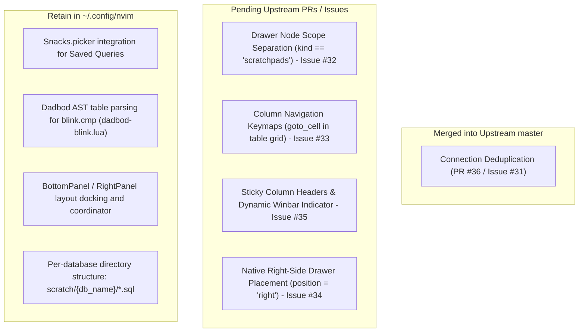

# Database Agent Guide: `sqmeow.nvim` Upstream Audit & Maintenance

This document serves as the single source of truth for managing our integration with [`2giosangmitom/sqmeow.nvim`](https://github.com/2giosangmitom/sqmeow.nvim). Use this guide in future sessions to compare our local overrides against the latest upstream repository, detect if upstream updates have made our patches redundant, and cleanly transition toward standard upstream code.

---

## 1. Upstream Baseline Reference

- **Upstream Repository**: [https://github.com/2giosangmitom/sqmeow.nvim.git](https://github.com/2giosangmitom/sqmeow.nvim.git)
- **Local Clone Location**: `/home/georgek/.local/share/nvim/lazy/sqmeow.nvim`
- **Baseline Commit Pinned**: `a6e0f8c05aa1a1db576aebbb23da9d9229f3d9d6` (`fix(api): reuse open connection in connect_named (#36)`, Sat Sep 26 2026)

### How New Sessions Must Audit Upstream
When starting a new session to inspect updates, run:
```bash
# Fetch latest commits without modifying working tree
git -C ~/.local/share/nvim/lazy/sqmeow.nvim fetch origin

# Check commits introduced since our baseline
git -C ~/.local/share/nvim/lazy/sqmeow.nvim log a6e0f8c05aa1a1db576aebbb23da9d9229f3d9d6..origin/master --oneline

# Inspect diffs across specific modules (api, drawer, result, table)
git -C ~/.local/share/nvim/lazy/sqmeow.nvim diff a6e0f8c05aa1a1db576aebbb23da9d9229f3d9d6..origin/master -- lua/sqmeow/api.lua lua/sqmeow/ui/drawer.lua lua/sqmeow/ui/result.lua lua/sqmeow/ui/table.lua
```

---

## 2. Classification of Local Modifications

We separate our code into two distinct buckets:
1. **Upstream Deficiencies & Bug Fixes**: Architectural problems or missing core features in `sqmeow.nvim`. These should be submitted to the upstream maintainer and removed from our config once merged.
2. **Personal Preferences & Workflow Integrations**: Custom keybindings, Snacks UI integration, Dadbod AST parsing for `blink.cmp`, window dimensions, and persistence paths. These belong in our user configuration permanently.



---

## 3. Detailed Audit Matrix

| Feature / Fix | Local Implementation | Root Cause / Reason | Upstream Status & Redundancy Criteria |
|---|---|---|---|
| **1. Connection Reuse** | [`M.ensure_sqmeow_connection`](file:///home/georgek/.config/nvim/lua/plugins/database.lua#L204) (direct `api.connect_named` call) | `sqmeow.api.connect_named(name)` previously generated duplicate connections unconditionally. | **RESOLVED & MERGED UPSTREAM ([PR #36](https://github.com/2giosangmitom/sqmeow.nvim/pull/36))**. Merged into master in commit `a6e0f8c`. Local deduplication workarounds have been retired from config. |
| **2. Per-DB Saved Queries in Drawer** | [`on_nodes` injection with `kind = 'saved_queries'`](file:///home/georgek/.config/nvim/lua/plugins/database.lua#L580) & [`drawer.actions.toggle` hook](file:///home/georgek/.config/nvim/lua/plugins/database.lua#L650) | In `drawer.lua`, `toggle()` matched `node.kind == 'scratchpads'` and toggled the global `SCRATCHPADS` container. Nodes under a connection also lacked native grouping. | **Upstream Candidate (Issue 2)**. If upstream adds native per-connection scratchpads/queries or isolates `SCRATCHPADS` checking by ID, our monkey patch on `drawer.actions.toggle` can be dropped. |
| **3. Result Column Navigation** | [`M.next_result_column`](file:///home/georgek/.config/nvim/lua/plugins/database.lua#L770), [`M.prev_result_column`](file:///home/georgek/.config/nvim/lua/plugins/database.lua#L780) (`<Tab>`, `<S-Tab>`, `]c`, `[c`) | `sqmeow.ui.table` has `Table:goto_cell({ 0, 1 })` and `goto_column()`, but `sqmeow/keymap.lua` defines zero column motions in `result`. | **Upstream Candidate (Issue 3)**. If upstream maps column navigation actions in `keymap.lua`, drop our custom helper and use standard upstream actions. |
| **4. Sticky Column Headers on Scroll** | [`M.update_sticky_header`](file:///home/georgek/.config/nvim/lua/plugins/database.lua#L818) & [`M.update_result_winbar`](file:///home/georgek/.config/nvim/lua/plugins/database.lua#L907) | Result grids with >15 rows lose headers when scrolled down. Users lose context of which column holds which values. | **Upstream Candidate (Issue 4)**. If upstream introduces a sticky header float or pins the active column in the header/winbar, remove our float lifecycle hook. |
| **5. Right-Side Drawer Placement** | [`M.open_drawer` + `wincmd L`](file:///home/georgek/.config/nvim/lua/plugins/database.lua#L400) | `sqmeow.ui.drawer.open` hardcodes `topleft vertical %dsplit` (far left). No option exists to place the drawer on the right (`botright`). | **Upstream Candidate (Issue 5)**. If upstream adds `ui.drawer.position = 'right'`, we can drop `wincmd L` and our custom resize schedule hook. |
| **6. SQL Table Context Parsing** | [`lua/utils/dadbod-blink.lua`](file:///home/georgek/.config/nvim/lua/utils/dadbod-blink.lua) | `vim-dadbod-completion` locked onto the first table when `b:db_table` was set. AST extraction parses active `FROM`/`JOIN` statements dynamically. | **User Configuration Only**. This bridges `vim-dadbod-completion` with `Saghen/blink.cmp` and is outside `sqmeow.nvim`'s core scope. |
| **7. Multi-Sidebar Coordination** | [`_G.RightPanel`](file:///home/georgek/.config/nvim/lua/plugins/database.lua#L386) & [`_G.BottomPanel`](file:///home/georgek/.config/nvim/lua/plugins/database.lua#L1474) | Mutual exclusivity between Snacks Explorer, OpenCode, and Database Drawer. | **User Configuration Only**. Keep permanently in personal dotfiles. |

---

## 4. Copy-Pasteable GitHub Issues for Upstream (`sqmeow.nvim`)

Copy and paste the markdown blocks below directly into new issues on [https://github.com/2giosangmitom/sqmeow.nvim/issues](https://github.com/2giosangmitom/sqmeow.nvim/issues).

---

### Issue 1: `api.connect_named(name)` unconditionally opens duplicate connections

**Title**: `bug(api): connect_named unconditionally creates duplicate connection sessions when connection is already open`

**Description**:
Calling `require('sqmeow.api').connect_named(name)` when a connection named `name` is already open and connected will unconditionally create a new connection entry with an incremented connection ID and re-register it in `state.connections`.

This causes identical connections (e.g. 4 copies of `test_db`) to accumulate in `sqmeow.state.connections` and appear multiple times in the drawer tree.

**Steps to Reproduce**:
```lua
local api = require('sqmeow.api')
local state = require('sqmeow.state')

-- Connect once
local id1 = api.connect_named('test_db')

-- Execute or switch to it again
local id2 = api.connect_named('test_db')
local id3 = api.connect_named('test_db')

print(#state.connection_list()) -- Prints 3 instead of reusing the active connection!
```

**Proposed Fix**:
In `lua/sqmeow/api.lua`, verify whether a connection with that name is already active before calling `M.connect`:

```lua
function M.connect_named(name)
  local state = require('sqmeow.state')
  local existing = state.connection_by_name(name)
  if existing and existing.state ~= 'closed' then
    M.use(existing.id)
    return existing.id
  end

  local spec = require('sqmeow.sources').find(name)
  if not spec then
    local message = ('there is no configured connection named `%s`'):format(name)
    notify(message, vim.log.levels.ERROR)
    return nil, message
  end

  return M.connect(spec.url, { name = spec.name, read_only = spec.read_only, ssh = spec.ssh })
end
```

---

### Issue 2: Drawer toggle handler conflates any node with `kind == 'scratchpads'` with the global container

**Title**: `fix(drawer): toggle() checks node.kind == 'scratchpads' instead of node identity, breaking custom tree nodes`

**Description**:
In `lua/sqmeow/ui/drawer.lua`, the `actions.toggle()` method contains:
```lua
if node.kind == 'scratchpads' then
  expanded[SCRATCHPADS] = not expanded[SCRATCHPADS] or nil
  return M.render()
end
```
Because `SCRATCHPADS = 'scratchpads'` is a global string constant representing the bottom scratchpad section, any custom child node or extension within the tree that uses `kind = 'scratchpads'` (such as grouping saved queries/scratchpads under an individual database connection) causes `toggle()` to toggle the bottom global scratchpad container instead of the node under the cursor.

**Proposed Fix**:
Match on the specific node ID or check that the node is top-level (not scoped to a connection/path):
```lua
if node.id == SCRATCHPADS or (node.kind == 'scratchpads' and not node.conn_id and (#node.path == 0)) then
  expanded[SCRATCHPADS] = not expanded[SCRATCHPADS] or nil
  return M.render()
end
```
Additionally, it would be a great feature enhancement if `sqmeow` natively supported grouping scratchpads / saved queries per connection in the drawer tree.

---

### Issue 3: Missing default keymaps for horizontal column navigation in result table

**Title**: `feat(result): add actions and keymaps to navigate horizontally between columns in the result grid`

**Description**:
`sqmeow.ui.table` already implements `Table:goto_cell(position, win)` with full support for display snapping and cell offsets (e.g. `{ 0, 1 }` for right, `{ 0, -1 }` for left), as well as `Table:goto_column(index, win)`.

However, `sqmeow/keymap.lua` only maps page-level navigation (`L` / `H`) and row detail (`K`), with no default keymaps to navigate horizontally between cells across columns. Users currently have to navigate character-by-character or using word motions inside cell text.

**Proposed Implementation**:
1. In `lua/sqmeow/ui/result.lua`, add `next_column` and `prev_column` actions:
```lua
function M.actions.next_column()
  if tbl then
    local cell = tbl:goto_cell({ 0, 1 }, win)
    if not cell and tbl._ and tbl._.columns and #tbl._.columns > 0 then
      tbl:goto_column(1, win) -- wrap around
    end
  end
end

function M.actions.prev_column()
  if tbl then
    local cell = tbl:goto_cell({ 0, -1 }, win)
    if not cell and tbl._ and tbl._.columns and #tbl._.columns > 0 then
      tbl:goto_column(#tbl._.columns, win) -- wrap around
    end
  end
end
```
2. In `lua/sqmeow/keymap.lua`, expose these actions under `result`:
```lua
{ action = 'next_column', lhs = { '<Tab>', ']c' }, desc = 'Next column' },
{ action = 'prev_column', lhs = { '<S-Tab>', '[c' }, desc = 'Previous column' },
```

---

### Issue 4: Sticky column headers and active column indicator when scrolling long result sets

**Title**: `feat(result): pin column headers when scrolling vertically & show active column in winbar`

**Description**:
When a query returns dozens or hundreds of rows, scrolling down past line 2 causes the column names and the separator rule (`├───┼───┤`) to scroll off the top of the window. In queries with many columns or wide numeric/text values, it becomes difficult to identify which column a given cell belongs to without scrolling all the way back to the top.

**Proposed Code Implementation**:

#### 1. In `lua/sqmeow/ui/result.lua`:
Add sticky header float state and lifecycle functions:

```lua
local sticky_buf = nil
local sticky_win = nil

local function close_sticky()
  if sticky_win and vim.api.nvim_win_is_valid(sticky_win) then
    pcall(vim.api.nvim_win_close, sticky_win, true)
  end
  sticky_win = nil
  if sticky_buf and vim.api.nvim_buf_is_valid(sticky_buf) then
    pcall(vim.api.nvim_buf_delete, sticky_buf, { force = true })
  end
  sticky_buf = nil
end

local function update_sticky()
  if not (win and utils.shows(win, buf)) then
    close_sticky()
    return
  end

  local line_count = vim.api.nvim_buf_line_count(buf)
  if line_count < HEADER_LINES + 1 then
    close_sticky()
    return
  end

  local w0 = vim.fn.line('w0', win)
  if w0 > HEADER_LINES then
    if not (sticky_buf and vim.api.nvim_buf_is_valid(sticky_buf)) then
      sticky_buf = vim.api.nvim_create_buf(false, true)
      vim.bo[sticky_buf].buftype = 'nofile'
      vim.bo[sticky_buf].bufhidden = 'hide'
      vim.bo[sticky_buf].swapfile = false
    end

    local header_lines = vim.api.nvim_buf_get_lines(buf, 0, HEADER_LINES, false)
    if #header_lines == HEADER_LINES then
      vim.bo[sticky_buf].modifiable = true
      vim.api.nvim_buf_set_lines(sticky_buf, 0, -1, false, header_lines)
      vim.bo[sticky_buf].modifiable = false

      -- Transfer header highlights/extmarks from NAMESPACE
      local hns = vim.api.nvim_create_namespace('sqmeow_sticky')
      vim.api.nvim_buf_clear_namespace(sticky_buf, hns, 0, -1)
      local marks = vim.api.nvim_buf_get_extmarks(buf, NAMESPACE, { 0, 0 }, { HEADER_LINES - 1, -1 }, { details = true })
      for _, m in ipairs(marks) do
        local row, col, details = m[2], m[3], m[4]
        if details and details.hl_group then
          pcall(vim.api.nvim_buf_set_extmark, sticky_buf, hns, row, col, {
            end_col = details.end_col,
            hl_group = details.hl_group,
            priority = details.priority,
          })
        end
      end

      local win_w = vim.api.nvim_win_get_width(win)
      local view = vim.api.nvim_win_call(win, vim.fn.winsaveview)

      if not (sticky_win and vim.api.nvim_win_is_valid(sticky_win)) then
        sticky_win = vim.api.nvim_open_win(sticky_buf, false, {
          relative = 'win',
          win = win,
          row = 0,
          col = 0,
          width = win_w,
          height = HEADER_LINES,
          focusable = false,
          style = 'minimal',
          zindex = 45,
        })
        if sticky_win and vim.api.nvim_win_is_valid(sticky_win) then
          vim.wo[sticky_win].wrap = false
          vim.wo[sticky_win].spell = false
        end
      else
        vim.api.nvim_win_set_config(sticky_win, { width = win_w, height = HEADER_LINES })
      end

      -- Synchronize horizontal scrolling 1:1 with parent window
      if sticky_win and vim.api.nvim_win_is_valid(sticky_win) then
        vim.api.nvim_win_call(sticky_win, function()
          vim.fn.winrestview({ leftcol = view.leftcol, topline = 1 })
        end)
      end
    end
  else
    if sticky_win and vim.api.nvim_win_is_valid(sticky_win) then
      pcall(vim.api.nvim_win_close, sticky_win, true)
      sticky_win = nil
    end
  end
end
```

#### 2. Enhance `M.update_winbar` in `lua/sqmeow/ui/result.lua`:
```lua
function M.update_winbar(summary)
  if not utils.shows(win, buf) or not require('sqmeow.config').get().ui.winbar then
    return
  end

  local state = require('sqmeow.state')
  local connection = summary and summary.conn_id and state.connections[summary.conn_id]
  if not connection and summary and summary.connection then
    connection = { name = summary.connection, dialect = summary.dialect }
  end
  connection = connection or state.current_connection()
  local label = connection and state.label(connection) or 'not connected'

  -- Dynamic active column information
  local col_info = ''
  local cell = M.current_cell()
  if cell and cell.name and cell.name ~= '' then
    local call = summary or state.call
    local total = call and call.columns and #call.columns or 0
    local col_type = call and call.columns and call.columns[cell.column + 1] and call.columns[cell.column + 1].type_name or ''
    col_info = ('  %%#SqmeowSignAdded#󰠵 %s%%*'):format(cell.name)
    if col_type ~= '' then
      col_info = col_info .. (' %%#SqmeowNull#(%s)%%*'):format(col_type)
    end
    if total > 0 then
      col_info = col_info .. (' %%#SqmeowNull#[%d/%d]%%*'):format(cell.column + 1, total)
    end
  end

  vim.wo[win].winbar = ('%%#SqmeowWinbar# %s  %%*%s%s'):format(label, M.describe(summary, true), col_info)
end
```

#### 3. Attach scroll and cursor listeners in `M.open()` / `M.buffer()`:
```lua
-- In M.open() or when creating the result buffer:
local group = vim.api.nvim_create_augroup('SqmeowResultSticky', { clear = true })
vim.api.nvim_create_autocmd({ 'CursorMoved', 'CursorMovedI' }, {
  group = group,
  buffer = buf,
  callback = function()
    M.update_winbar(require('sqmeow.state').call)
    update_sticky()
  end,
})
vim.api.nvim_create_autocmd({ 'WinScrolled' }, {
  group = group,
  callback = function()
    if win and vim.api.nvim_get_current_win() == win then
      update_sticky()
    end
  end,
})
vim.api.nvim_create_autocmd({ 'BufLeave', 'BufHidden', 'BufDelete', 'WinClosed' }, {
  group = group,
  buffer = buf,
  callback = close_sticky,
})
```

#### 4. Clean up in `M.close()`:
```lua
function M.close()
  close_sticky()
  -- (existing close logic continues...)
```

#### 5. Config toggle in `lua/sqmeow/config.lua`:
```lua
ui = {
  result = {
    sticky_header = true,      -- pin column header when scrolling down past line 2
    winbar_column_info = true, -- display active column name and type in winbar
  },
}
```

---

### Issue 5: Configurable drawer placement (`position = 'right' | 'left'`) and responsive width support

**Title**: `feat(drawer): allow configuring drawer placement on the right ('position = right') and responsive width`

**Description**:
Currently, `sqmeow.ui.drawer.open()` hardcodes the split command:
```lua
vim.cmd(('topleft vertical %dsplit'):format(config.width))
```
`topleft` forces the drawer window strictly to the far-left side of the screen.

In modern editor setups (such as VSCode, Zed, or Neovim configurations where file trees sit on the left and database/tools panels sit on the right), users cannot configure `sqmeow` to anchor the drawer on the right side.

To achieve right-side placement currently, users must hack around it by hooking `open()` and running `wincmd L` and manually re-applying width. Using Vim's native `botright vertical %dsplit` allows flawless, native right-side placement that works consistently across all screen sizes, aspect ratios, and ultrawide monitors.

**Proposed Implementation**:
1. In `lua/sqmeow/config.lua`, add `position` to `ui.drawer`:
```lua
ui = {
  drawer = {
    position = 'left', -- 'left' | 'right'
    width = 35,
  },
}
```
2. In `lua/sqmeow/ui/drawer.lua` (`M.open()`):
```lua
local split_cmd = config.position == 'right' and 'botright' or 'topleft'
vim.cmd(('%s vertical %dsplit'):format(split_cmd, config.width))
```
*(Bonus: support responsive or percentage widths if `config.width` is a string like `'20%'` or a function `function() return math.min(50, math.floor(vim.o.columns * 0.2)) end`)*.
